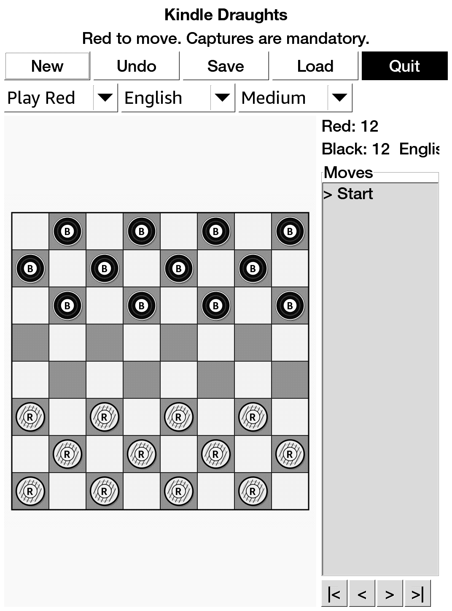

# Exact Draughts

A practical Kindle-friendly draughts/checkers app using GTK2/Cairo and the same
Mesquite/KUAL packaging approach as Kindle GlChess.

Exact Draughts is an unofficial Kindle-focused adaptation using artwork from
Draughts by Thiago Fernandes (`tobagin`), <https://github.com/tobagin/Draughts>.
It replaces the original desktop application shell with a compact native Kindle
interface for jailbroken Kindle devices.

## Screenshot



## Features

- Touch-friendly draughts/checkers board with English 8x8 and International
  10x10 variants.
- Modes for Play Red, Play Black, 2 Players, and AI Demo.
- Deterministic minimax AI with Easy, Medium, and Hard levels.
- Legal diagonal moves, mandatory captures, multi-capture continuation, king
  promotion, undo, save, load, new game, and quit.
- International rules include backward man captures, flying kings, and longest
  capture-line filtering.
- Right-side move history panel with first/previous/next/latest playback
  controls. Gameplay is disabled while reviewing older board states.
- Uses high-contrast Cairo pieces with R/B/K labels for e-ink legibility.
- KUAL extension package with bundled ARM GTK2/Cairo runtime libraries.

## Install

Use the prebuilt extension package:

```text
release/exact-draughts-extension.zip
```

Unzip it at the Kindle USB-storage root so it creates:

```text
/mnt/us/extensions/exact-draughts
/mnt/us/documents/shortcut_exactdraughts.sh
```

Launch from KUAL:

```text
KUAL -> Exact Draughts -> Exact Draughts
```

## Build

```bash
./docker_rebuild.sh
```

If ARM containers are not enabled:

```bash
docker run --privileged --rm tonistiigi/binfmt --install arm
```

## License And Provenance

This is not an official Draughts release, not part of the original GNOME Games
package, and not an official GnomeGames4Kindle release. Draughts is GPLv3 or
later; see [docs/PROVENANCE.md](docs/PROVENANCE.md).
